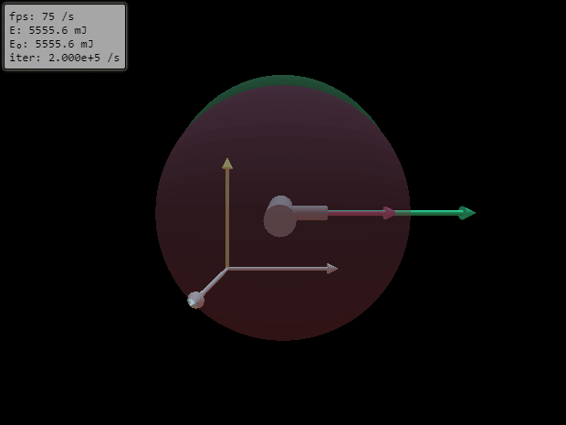

# Dzhanibekov effect simulation

Numerical simulation of the Dzhanibekov or tennis racket effect

[demo.webm](docs/demo.webm)

### Background

[Wikipedia](https://en.wikipedia.org/wiki/Tennis_racket_theorem)

### Alternate names
- Tennis racket theorem
- Intermediate axis theorem

